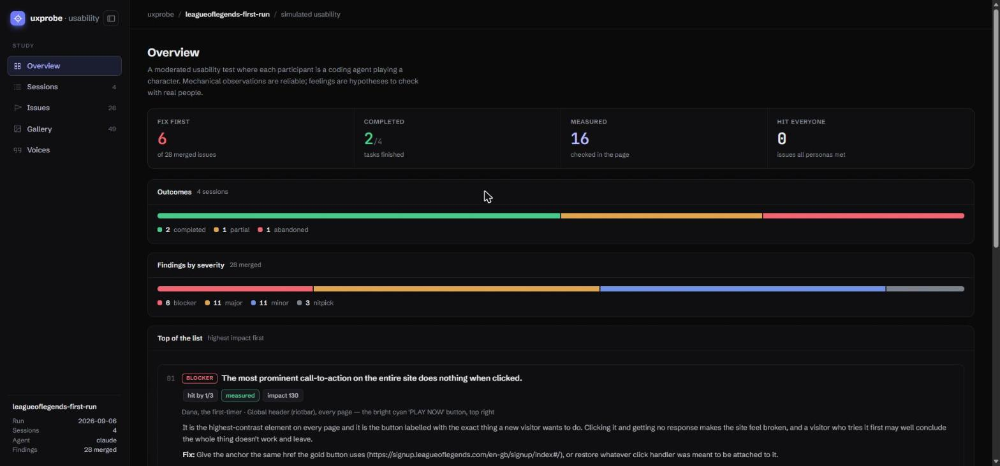
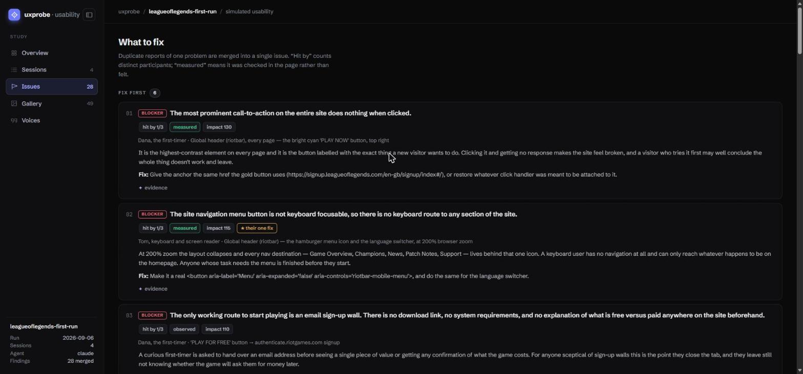
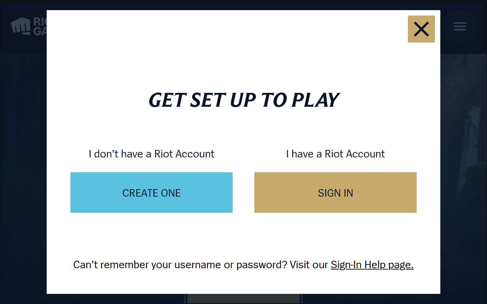
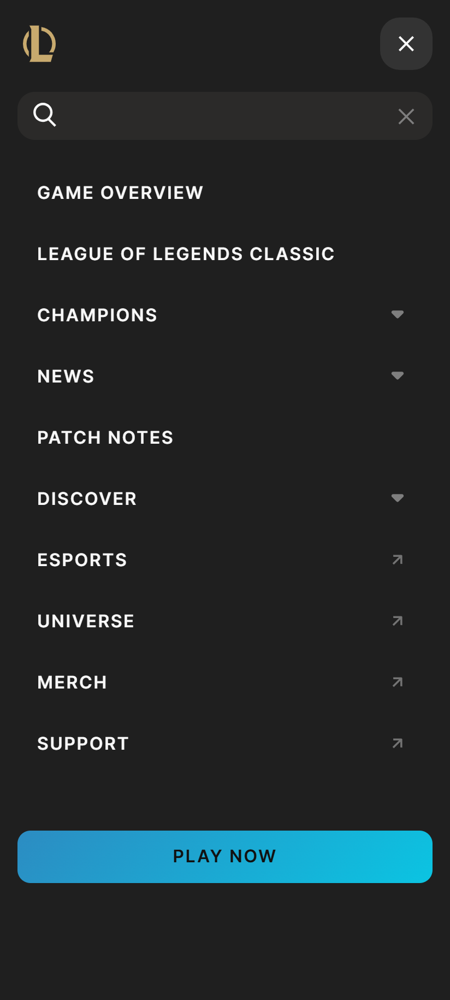

# uxprobe

**A real usability test, in the time it takes to make a coffee.**

Point a coding CLI you already have (`claude`, `codex`, `gemini`, `cursor-agent`) at a
website, hand it a persona and a task, and it role-plays that person using your site: what
they tried, what they expected, what actually happened, where they got stuck, and how they
felt. You get back a ranked, deduplicated list of what to fix, graded by how good the
evidence is.

No recruiting. No scheduling. No test plan. Just a URL.

<p align="center">
  
</p>

<p align="center">
  <sub>MIT licensed · no required dependencies · Python 3.10+ · works with the coding CLI you already have</sub>
  <br>
  <sub><a href="docs/uxprobe-demo.mp4">▶ watch the full-resolution video</a></sub>
</p>

## Try it in 60 seconds

```bash
git clone https://github.com/m-ahmed-elbeskeri/uxprobe
cd uxprobe
pip install -e .
```

That puts `uxprobe` on your PATH, so you can run it from any folder, against any site.
There is a ready-to-run study in the repo (a first run at the League of Legends site,
four personas trying to work out what the game is and how to start), so you can watch the
whole thing work before pointing it at your own product:

```bash
uxprobe study example-study.yaml --echo --open
```

Or go straight at your own site:

```bash
uxprobe run --url https://yoursite.com \
            --task "Work out what this company does and whether it is for you" \
            --persona first-timer --persona mobile-commuter --persona screen-reader \
            --open
```

```
▶ Dana, the first-timer → Work out what this company does  (claude)
■ Dana, the first-timer → Work out what this company does: abandoned · difficulty 4/5 · 1 blocker · 214s
▶ Aisha, on the train → Work out what this company does  (claude)
■ Aisha, on the train → Work out what this company does: partial · difficulty 3/5 · 0 blockers · 187s
```

`--echo` streams the agent's thinking to your terminal so you can watch it work.
`--open` pops the dashboard the moment it finishes.

---

## What you get

Every study builds one self-contained HTML dashboard. Outcomes and the headline numbers up
top, one row per session, then every duplicate finding merged into a single ranked issue
with its reach and evidence grade.

<p align="center">
  
  
</p>

Each participant drives a **real browser in character** and screenshots every meaningful
step, so the write-up shows what they actually saw, wired to the moment that produced it.
These four are from the shipped example study, a first run at League of Legends: the
sign-up wall that turns out to be the only route to start, the "Play for free" button, the
"Get set up to play" overlay a screen-reader user got stuck in, and a non-native speaker
opening the menu to hunt for a language option.

<p align="center">
  
  
  
  
</p>

Everything also lands on disk as Markdown, JSON and CSV, so it drops straight into a PR, a
wiki, or your tracker.

---

## Read this before you trust the output

These are **simulated participants**, not users. That difference matters:

| Reliable | A hypothesis |
|---|---|
| The Continue button did nothing on the second click | "This made me feel stupid" |
| The email input has no `<label>` | "Most users would give up here" |
| Pricing is not published anywhere | An ease score of 41/100 |
| Three console errors on page load | Anything expressed as a percentage |

The mechanical observations are genuinely useful, and they often catch things a developer
who knows the product too well cannot see any more. The feelings are plausible fiction:
good for generating things to check with real people, useless as measurements. Do not
average the scores into a metric and put it on a slide. Small n, and the n is not people.

---

## Installing and driving it

`uxprobe` itself has no required dependencies (PyYAML is optional, and only for `.yaml`
study files). What it needs is a coding CLI to drive, **and that CLI needs a way to reach a
browser**:

| CLI | `--agent` | How it gets a browser |
|---|---|---|
| Claude Code | `claude` | The Claude in Chrome extension, or a Playwright MCP server |
| Codex CLI | `codex` | An MCP browser server in `~/.codex/config.toml` |
| Gemini CLI | `gemini` | An MCP browser server in its settings |
| Cursor Agent | `cursor` | MCP browser server |
| anything else | `custom` | `--cmd "mycli -p {prompt}"` |

Check what you have with `uxprobe agents`.

If the agent has no browser at all, it is told to say so rather than invent a session. A
run that reports `outcome: failed` with "I had no way to open a browser" is the tool
working correctly, not lying to you.

No MCP browser server? `--browser playwright-script` tells the agent to write and run its
own Playwright script. It is slower, but it needs nothing but Playwright installed, and it
just works.

If a session dies halfway through, you do not have to redo the whole study:

```bash
uxprobe study example-study.yaml --resume runs/20260906-111811-leagueoflegends-first-run
```

Sessions that already produced a usable report are skipped, and only the missing ones run
again.

---

## Use it

### One-off

```bash
uxprobe run --url https://shop.example \
            --task "Buy a blue jumper in size medium, but stop before paying" \
            --persona mobile-commuter \
            --success "Found a blue jumper" --success "Got to a checkout page" \
            --max-steps 30 --echo
```

`--persona all` runs the whole built-in cast.

### A study file

The shipped [`example-study.yaml`](example-study.yaml) is the quickest way to see real
output. To build your own, scaffold a commented template and edit it:

```bash
uxprobe init study.yaml
uxprobe study study.yaml --echo --open
```

```yaml
name: checkout-review
base_url: https://shop.example
agents: [claude]
browser: auto
timeout: 900

personas:
  - first-timer
  - screen-reader
  - extends: power-user          # tweak a built-in
    id: power-user-impatient
    patience: low
    context: Has 90 seconds between meetings.
  - id: budget-parent            # or write your own
    name: Nadia, budgeting for the family
    device: phone
    patience: low
    goals: [Find the real total including delivery before committing]
    frustrations: [Fees that only appear at the last step]

tasks:
  - id: find-total
    title: Find the true total price
    goal: You have £40. Work out whether you can afford one jumper delivered.
    success_criteria:
      - Knows the delivery cost before reaching the payment step
    max_steps: 20

guardrails:
  - Do not create a real account; stop at the final submit and say what you expect.
```

### Not sure which personas to use? Ask your agent

You do not have to write the cast by hand. Open your coding agent in your own project,
point it at wherever you cloned uxprobe, and ask it to draft a study for your site. It can
read the persona format and invent a cast that would realistically struggle with what you
have built. For example:

> Using the uxprobe study format in `../uxprobe/example-study.yaml`, write a `study.yaml`
> for `https://mysite.com` with four personas who would genuinely find my sign-up flow
> hard, and one task each. Keep the safety guardrails.

Most coding agents will happily do this. Read what it wrote, then run
`uxprobe study study.yaml`.

### Afterwards

```bash
uxprobe report  runs/20260906-101500-shop-example      # rebuild the dashboards
uxprobe synth   runs/20260906-101500-shop-example      # agent-written findings memo
uxprobe compare runs/OLD runs/NEW                       # did the fixes land?
```

`compare` matches this study's issues against an earlier run and tells you what is
**gone**, **still there**, and **new**, which is the question you actually have after
shipping a fix.

`synth` sends every session's JSON back through an agent and writes `findings.md`. Reach
for it when the heuristic merge is not quite enough.

---

## What it gives a PM, a designer and a dev

Raw findings are not a plan. Three sessions can produce 34 findings, and that is a reading
task, not a decision. `uxprobe` reduces them to a ranked, deduplicated list:

```
## Fix first (2)

1. 🛑 Card tiles are div role="button" with no keyboard activation handler
   `blocker` · hit by 1/3 · evidence: measured · impact 149.5
   ★ named as the one thing to fix by Tom

2. 🛑 A visually modal tour overlay with no dialog semantics or Escape handler
   `blocker` · hit by 2/3 · evidence: measured · impact 130
   ⚖ rated blocker by one person, minor by another
```

**Is it real?** Every issue is graded by the evidence behind it:

| Grade | Means | What to do |
|---|---|---|
| `measured` | Checked in the page: markup, computed style, a key press with a recorded result | Reproduce it and fix it |
| `observed` | Quotes what was on screen, with no measurement | A minute to confirm |
| `impression` | No evidence recorded | A question for a real user, not a ticket |

**Who does it hit?** The same defect described three different ways is merged into one
issue that shows its reach. Merging deliberately ignores severity, so when one participant
calls something a blocker and another shrugs, you see `⚖ disputed`. That is often the most
interesting line in the report, because it tells you *who* the interface is really built
for.

**What should you do first?** Impact is severity weighted by corroboration, evidence
quality, and whether anyone actually failed the task. Someone who rated an issue trivial
does not inflate its reach, and each participant's own "if you fix one thing" answer counts
as a priority signal.

It all lands in `issues.md` (paste-into-your-tracker blocks) and `issues.csv`.

---

## The personas

Run `uxprobe personas` for the list, or add `-v` for the full prompt block each one gets.

| id | who |
|---|---|
| `first-timer` | Never seen the product, does not know the jargon, wants to know what it is in 15 seconds |
| `power-user` | Keyboard-first, low patience, has used four competitors, hates onboarding tours |
| `mobile-commuter` | One-handed on a phone, standing up, patchy signal, two minutes to spare |
| `screen-reader` | Keyboard only, screen reader, 200% zoom; finds labelling and focus bugs nothing else does |
| `skeptical-buyer` | Holds the budget, comparing vendors, wants pricing and security answers |
| `impatient-returner` | Had an account once, remembers neither the password nor the email |
| `cautious-senior` | Reads everything, afraid of clicking the wrong thing, needs confirmation |
| `distracted-multitasker` | Leaves mid-flow and comes back with no memory of where they were |
| `edge-case-hunter` | QA brain: back button mid-flow, empty submits, watches the console |
| `non-native-speaker` | Idioms and puns in button labels slow them right down |

Each persona is deliberately given something it is impatient about. A persona with no
bail-out triggers writes a bland, agreeable report that tells you nothing.

`uxprobe personas --export mine.json` dumps them all, so you can edit and reuse them via
`persona_files:` in a study.

---

## Safety rails

Every session prompt carries non-negotiable house rules: no real purchases, no real
personal data, no irreversible actions on anyone's account, no bypassing logins or
captchas, and stay on the target domain. The agent is told to walk up to a destructive
button, describe what it expects to happen, and stop. Study-level `guardrails:` are
**added** to those defaults, never swapped in for them.

That said: **run this against sites you own or are authorised to test.** The rails are
prompt-level instructions to a language model, not a sandbox. Treat them the way you would
a brief to a contractor.

`--yolo` passes your CLI's skip-permissions flag so unattended runs do not stall on
prompts. It removes your CLI's own confirmation step, so reach for it deliberately, not by
default.

---

## What lands on disk

```
runs/20260906-101500-shop-example/
├── index.html                     # dashboard: outcomes, ranked friction, quotes
├── index.md                       # the same, for a PR or a wiki
├── summary.json                   # every run, machine-readable
├── events.jsonl                   # append-only run log
├── issues.md                      # ranked, ticket-ready issue blocks
├── issues.csv                     # one row per merged issue, for a tracker
├── findings.md                    # written by `uxprobe synth`
└── mobile-commuter__find-total/
    ├── report.md                  # the readable write-up, screenshots inline
    ├── report.json                # the normalised structured report
    ├── prompt.txt                 # exactly what the agent was told
    ├── agent_text.md              # the agent's final message
    ├── stdout.log / stderr.log    # the raw transcript
    ├── argv.json                  # the exact command that ran
    └── 01-hero.png ...            # screenshots, wired to the steps that took them
```

Screenshots are embedded in `report.md` right next to the thought that produced them, and
appear as a per-persona filmstrip in the dashboard. Anything else the session downloaded,
like an export file or a generated PDF, is listed under "Files the session produced",
because that is often the hardest evidence in the run.

A session report holds a step table (intent, action, expected, got, felt, friction), the
thinking-aloud transcript, severity-ranked friction points with evidence and suggested
fixes, what actually worked, accessibility notes, and both an in-character summary and an
out-of-character analyst summary.

---

## Notes on getting good output

- **Tasks beat instructions.** "Find out whether you can afford this" produces a real
  session. "Click the pricing link" produces an obedient robot.
- **Run the same persona twice** (`--repeat 2`). If two runs disagree wildly, the finding
  is noise. If they hit the same wall, look hard at that wall.
- **`--persona screen-reader` earns its keep.** Missing labels, focus traps and
  unreachable controls are mechanical facts, and this is the persona that trips over them.
- **Give it a budget.** `--max-steps` is what makes giving up possible, and giving up is
  usually the most informative outcome you can get.
- **`--concurrency 1` when sharing one browser.** Parallel sessions fighting over the same
  Chrome window produce garbage. Parallelism is safe once each agent drives its own
  Playwright instance.
- Start with one persona and one task. Check the output is worth it, then widen.

---

## Python API

```python
from uxprobe import Persona, Task, RunSpec, get_persona
from uxprobe.runner import execute_study, make_out_dir

specs = [
    RunSpec(
        persona=get_persona("screen-reader"),
        task=Task.from_dict({
            "title": "Reset a forgotten password",
            "goal": "Get back into your account without a mouse.",
            "url": "https://app.example/login",
        }),
        agent="claude",
    )
]
out = make_out_dir("runs", "a11y-check")
results = execute_study(specs, out, "a11y-check")
print(results[0].report["friction_points"])
```

## Licence

MIT.
